# MiWiFi for Home Assistant
[](https://github.com/hacs/integration)
[](https://github.com/dmamontov/hass-miwifi/actions?query=CodeQL)

Component for tracking devices and managing routers based on [MiWiFi](http://miwifi.com/) from [Home Assistant](https://www.home-assistant.io/).

## Table of Contents
- [FAQ](#faq)
- [Conflicts](#conflicts)
- [Install](#install)
- [Config](#config)
  - [Advanced config](#advanced-config)
- [Performance table](#performance-table)
- [Supported routers](#supported-routers)
  - [API check list](#api-check-list)
  - [Summary](#summary)
- [Diagnostics](#diagnostics)

## FAQ
**Q. Do I need to get telnet or ssh?**

**A.** Not. integration works through Luci-API

**Q. How often are states updated?**

**A.** The default is every 30 seconds, but this setting can be configured. It is not recommended to set less than 10 seconds.

**Q. Does the integration support routers connected in `repeater mode` or `access point mode`?**

**A.** Yes, the integration supports devices connected in `repeater mode` or `access point mode`. But to get the number of devices and their tracking, you will also need to connect and configure the parent router.

**Q. Can I use the router in `repeater mode` or `access point mode` without a parent MiWiFi device?**

**A.** It is possible with the `is_force_load` option enabled. But there is a limitation. You will not see IP, uptime, and connection type, but the name will be the mac-address.

**Q. Does Mesh support routers?**

**A.** Yes, they are supported.

**Q. Is a reboot required after changing the [PRO] settings?**

**A.** Not required, but desirable.

**Q. How to convert device `signal` to text representation?**

**A.** `signal >= 80` = Excellent, `80 > signal >= 30` = good, `30 > signal` = bad

## Conflicts
The following component conflicts are currently known:
* **xiaomi** (device_tracker)
  * **Cause**: Due to the fact that they use the same API, logout occurs after each scan 
  * **Solution**: I recommend turning it off for this router

* **nmap** (device_tracker)
   * **Cause**: Because nmap uses the old integration and finds your devices, it simply overwrites their attributes
   * **Solution**: Exclude router netmask from scanning

* **pihole**
    * **Cause**: Devices stop being tracked
    * **Solution**: Disable the pihole app
    * **PS**: Perhaps you can customize, if someone configures write, I will add instructions

## Install
The easiest way to install the `MiWiFi` integration is with [HACS](https://hacs.xyz/). First install [HACS](https://hacs.xyz/) if you don’t have it yet. After installation you can find this integration in the [HACS](https://hacs.xyz/) store under integrations.

Alternatively, you can install it manually. Just copy and paste the content of the hass-miwifi/custom_components folder in your config/custom_components directory. As example, you will get the sensor.py file in the following path: /config/custom_components/miwifi/sensor.py. The disadvantage of a manual installation is that you won’t be notified about updates.

## Config
**Via GUI**

`Settings` > `Integrations` > `Plus` > `MiWiFi`

For authorization, use the ip of your router and its password

❗ Via YAML (legacy way) not supported

### Advanced config
#### Automatically remove devices
The component supports automatic deletion of monitored devices after a specified number of days (Default: 30 days) after the last activity. If you specify 0, then automatic deletion will be disabled.

**Via GUI (Recommended)**

`Settings` > `Integrations` > `Your integration MiWiFi` > `Settings`

## Performance table


1. Install [Auto-entities](https://github.com/thomasloven/lovelace-auto-entities) from HACS
2. Install [Flex Table](https://github.com/custom-cards/flex-table-card) from HACS
3. Add new Lovelace tab with **Panel Mode**
4. Add new Lovelace card:
   - [example](https://gist.github.com/dmamontov/d977cd01c861d1f5e66327af22fd084b)
   - [example (force mode)](https://gist.github.com/dmamontov/95990dfd155c6ef92e0e7f46762bfcc2)

## Supported routers
Many more Xiaomi and Redmi routers supported by MiWiFi (OpenWRT - Luci API)

### API check list

##### Required
- `xqsystem/login` - Authorization.
- `xqsystem/init_info` - Basic information about the router.
- `misystem/status` - Basic information about the router. Diagnostic data, memory, temperature, etc.
- `xqnetwork/mode` - Operating mode. Repeater, Access Point, Mesh, etc.

##### Additional
- `misystem/topo_graph` - Topography, auto discovery does not work without it.
- `xqsystem/check_rom_update` - Getting information about a firmware update
- `xqnetwork/wan_info` - WAN port information.
- `misystem/led` - Interaction with LEDs.
- `xqnetwork/wifi_diag_detail_all` - Getting information about WiFi adapters
- `xqnetwork/avaliable_channels` - Gets available channels for WiFi adapter
- `xqnetwork/wifi_connect_devices` - Get information about connected devices
- `misystem/devicelist` - More information about connected devices
- `xqnetwork/wifiap_signal` - AP signal in repeater mode
- `misystem/newstatus` - Additional information about connected devices for force load mode

##### Action
- `xqsystem/reboot` - Reboot
- `xqsystem/upgrade_rom` - Firmware update.
- `xqnetwork/set_wifi` - Update WiFi settings. Causes the adapter to reboot.
- `xqnetwork/set_wifi_without_restart` - Update Guest WiFi settings.

❗ If your router is not listed or not tested, try adding an integration, it will check everything and give a link to create an issue. You just have to click `Submit new issue`

❗ If at the time of adding the integration only `Router {ip} not supported` message is displayed, please create an issue with the message that the router is not supported, indicating the model of the router.

### Summary

- 🟢 - Supported
- 🔴 - Not supported
- ⚪ - Not tested

| Image                    | Router                                 | Code   | Required           | Additional                   | Action           |
| ------------------------ | -------------------------------------- |:------:|:------------------:|:----------------------------:|:----------------:|
| 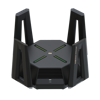     | **Xiaomi Router Xiaomi AX9000**        | RA70   | <sub>🟢🟢🟢🟢</sub> | <sub>🟢🟢🟢🟢🟢🟢🟢🟢🟢🟢</sub> | <sub>🟢🟢🟢🟢</sub> |
| 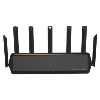     | **Xiaomi Router AX6000**               | RA72   | <sub>🟢🟢🟢🟢</sub> | <sub>🟢🟢🟢🟢🟢🟢🟢🟢🟢🟢</sub> | <sub>🟢🟢🟢🟢</sub> |
|      | **Redmi Router AX6000**                | RB06   | <sub>🟢🟢🟢🟢</sub> | <sub>🟢🟢🟢🟢🟢🟢🟢🟢🟢🟢</sub> | <sub>🟢🟢🟢🟢</sub> |
| 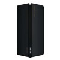     | **Xiaomi Mesh System AX3000**          | RA82   | <sub>🟢🟢🟢🟢</sub> | <sub>🟢🟢🟢🟢🟢🟢🟢🟢🟢🟢</sub> | <sub>🟢🟢🟢🟢</sub> |
|      | **Xiaomi Router AX3000**               | RA80   | <sub>🟢🟢🟢🟢</sub> | <sub>🟢🟢🟢🟢🟢🟢🟢🟢🟢🟢</sub> | <sub>🟢🟢🟢🟢</sub> |
|      | **Redmi Router AX6S**                  | RB03   | <sub>🟢🟢🟢🟢</sub> | <sub>🟢🟢🟢🟢🟢🟢🟢🟢🟢🟢</sub> | <sub>🟢🟢🟢🟢</sub> |
|      | **Redmi Router AX3000**                | RA81   | <sub>🟢🟢🟢🟢</sub> | <sub>🟢🟢🟢🟢🟢🟢🟢🟢🟢🟢</sub> | <sub>🟢🟢🟢🟢</sub> |
| 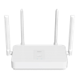     | **Redmi Router AX1800**                | RA71   | <sub>🟢🟢🟢🟢</sub> | <sub>🟢🟢🟢🟢🟢🟢🟢🟢🟢🟢</sub> | <sub>🟢🟢🟢🟢</sub> |
| 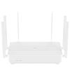     | **Redmi Router AX6**                   | RA69   | <sub>🟢🟢🟢🟢</sub> | <sub>🟢🟢🟢🟢🟢🟢🟢🟢🟢🟢</sub> | <sub>🟢🟢🟢🟢</sub> |
|      | **Redmi Router AX5**                   | RA67   | <sub>🟢🟢🟢🟢</sub> | <sub>🟢🟢🟢🟢🟢🟢🟢🟢🟢🟢</sub> | <sub>🟢🟢🟢🟢</sub> |
| 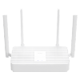     | **Redmi Router AX5**                   | RA50   | <sub>🟢🟢🟢🟢</sub> | <sub>🟢🟢🟢🟢🟢🟢🟢🟢🟢🟢</sub> | <sub>🟢🟢🟢🟢</sub> |
|    | **Mi Router AX1800**                   | RM1800 | <sub>🟢🟢🟢🟢</sub> | <sub>🟢🟢🟢🟢🟢🟢🟢🟢🟢🟢</sub> | <sub>🟢🟢🟢🟢</sub> |
|    | **Xiaomi AIoT Router AX3600**          | R3600  | <sub>🟢🟢🟢🟢</sub> | <sub>🟢🟢🟢🟢🟢🟢🟢🟢🟢🟢</sub> | <sub>🟢🟢🟢🟢</sub> |
| 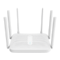   | **Redmi Router AC2100**                | RM2100 | <sub>🟢🟢🟢🟢</sub> | <sub>🟢🟢🟢🟢🟢🟢🟢🟢🟢🟢</sub> | <sub>🟢🟢🟢🟢</sub> |
| 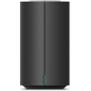    | **Mi Router AC2100**                   | R2100  | <sub>🟢🟢🟢🟢</sub> | <sub>🟢🟢🟢🟢🟢🟢🟢🟢🟢🟢</sub> | <sub>🟢🟢🟢🟢</sub> |
| 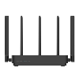    | **Mi Router 4 Pro**                    | R1350  | <sub>🟢🟢🟢🟢</sub> | <sub>🟢🟢🟢🟢🟢🟢🟢🟢🟢🟢</sub> | <sub>🟢🟢🟢🟢</sub> |
| 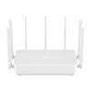    | **Mi AIoT Router AC2350**              | R2350  | <sub>🟢🟢🟢🟢</sub> | <sub>🟢🟢🟢🟢🟢🟢🟢🟢🟢🟢</sub> | <sub>🟢🟢🟢🟢</sub> |
| 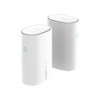      | **Mi Router Mesh**                     | D01    | <sub>🟢🟢🟢🟢</sub> | <sub>🟢🟢🟢🟢🟢🟢🟢🟢🟢🔴</sub> | <sub>🟢🟢🟢🟢</sub> |
|      | **Mi Router 4A**                       | R4AC   | <sub>🟢🟢🟢🟢</sub> | <sub>🟢🟢🟢🟢🟢🟢🟢🟢🟢🔴</sub> | <sub>🟢🟢🟢🟢</sub> |
|       | **Mi Router 4A Gigabit**               | R4A    | <sub>🟢🟢🟢🟢</sub> | <sub>🟢🟢🟢🟢🟢🟢🟢🟢🟢🔴</sub> | <sub>🟢🟢🟢🟢</sub> |
|      | **Mi Router 4C**                       | R4CM   | <sub>🟢🟢🟢🟢</sub> | <sub>🟢🟢🟢🟢🟢🟢🟢🟢🟢🔴</sub> | <sub>🟢🟢🟢🟢</sub> |
|        | **Mi Router 4**                        | R4     | <sub>🟢🟢🟢🟢</sub> | <sub>🟢🟢🟢🟢🟢🟢🟢🟢🟢🔴</sub> | <sub>🟢🟢🟢🟢</sub> |
| 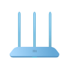      | **Mi Router 4Q**                       | R4C    | <sub>🟢🟢🟢🟢</sub> | <sub>🟢🟢🟢🟢🟢🟢🟢🟢🟢🔴</sub> | <sub>🟢🟢🟢🟢</sub> |
| 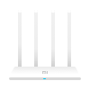      | **Mi Router 3A**                       | R3A    | <sub>🟢🟢🟢🟢</sub> | <sub>🟢🟢🟢🟢🟢🟢🟢🟢🟢🔴</sub> | <sub>🟢🟢🟢🟢</sub> |
|       | **Mi Router 3C**                       | R3L    | <sub>🟢🟢🟢🟢</sub> | <sub>🟢🟢🟢🟢🟢🟢🟢🟢🟢🔴</sub> | <sub>🟢🟢🟢🟢</sub> |
|       | **Mi Router HD**                       | R3D    | <sub>🟢🟢🟢🟢</sub> | <sub>🟢🟢🟢🟢🟢🟢🟢🟢🟢🔴</sub> | <sub>🟢🟢🟢🟢</sub> |
|       | **Mi Router Pro**                      | R3P    | <sub>🟢🟢🟢🟢</sub> | <sub>🟢🟢🟢🟢🟢🟢🟢🟢🟢🔴</sub> | <sub>🟢🟢🟢🟢</sub> |
|        | **Mi Router 3**                        | R3     | <sub>🟢🟢🟢🟢</sub> | <sub>🟢🟢🟢🟢🟢🟢🟢🟢🟢🔴</sub> | <sub>🟢🟢🟢🟢</sub> |
|        | **Mi Router 3G**                       | R3G    | <sub>🟢🟢🟢🟢</sub> | <sub>🟢🟢🟢🟢🟢🟢🟢🟢🟢🔴</sub> | <sub>🟢🟢🟢🟢</sub> |
|      | **Mi Router Lite**                     | R1CL   | <sub>🟢🟢🟢🟢</sub> | <sub>🟢🟢🟢🟢🟢🟢🟢🟢🟢🔴</sub> | <sub>🟢🟢🟢🟢</sub> |
|       | **Mi Router Mini**                     | R1CM   | <sub>🟢🟢🟢🟢</sub> | <sub>🟢🟢🟢🟢🟢🟢🟢🟢🟢🔴</sub> | <sub>🟢🟢🟢🟢</sub> |
| 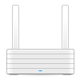      | **Mi Router R2D**                      | R2D    | <sub>🟢🟢🟢🟢</sub> | <sub>🟢🟢🟢🟢🟢🟢🟢🟢🟢🔴</sub> | <sub>🟢🟢🟢🟢</sub> |
| 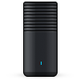      | **Mi Router R1D**                      | R1D    | <sub>🟢🟢🟢🟢</sub> | <sub>🟢🟢🟢🟢🟢🟢🟢🟢🟢🔴</sub> | <sub>🟢🟢🟢🟢</sub> |

## Diagnostics
You will need to obtain diagnostic data to search for a problem or before creating an issue.

### Via GUI:

How to obtain diagnostic data can be found on the website HASS: [Diagnostic Documentation](https://www.home-assistant.io/integrations/diagnostics/)

### Via Logger:

❗ Check the data that you publish in the issue, they may contain secret data.

Set component to debug mode and reload HASS:

```yaml
logger:
  default: error
  logs:
    ...
    custom_components.miwifi: debug
```

Then wait a bit and you can watch the logs, they will need information