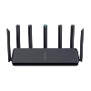
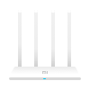

# MiWiFi for Home Assistant

The component allows you to monitor devices and manage routers based on [MiWiFi](http://miwifi.com/) from [Home Assistant](https://www.home-assistant.io/).

❗ Supports routers with original or original patched MiWifi firmware

## More info
- [Install](https://github.com/dmamontov/hass-miwifi/wiki/Install)
- [Config](https://github.com/dmamontov/hass-miwifi/wiki/Config)
  - [Advanced config](https://github.com/dmamontov/hass-miwifi/wiki/Config#advanced-config)
    - [Automatically remove devices](https://github.com/dmamontov/hass-miwifi/wiki/Config#automatically-remove-devices)
- [Supported routers](https://github.com/dmamontov/hass-miwifi/wiki/Supported-routers)
  - [Check list](https://github.com/dmamontov/hass-miwifi/wiki/Supported-routers#check-list)
    - [Required](https://github.com/dmamontov/hass-miwifi/wiki/Supported-routers#required)
    - [Additional](https://github.com/dmamontov/hass-miwifi/wiki/Supported-routers#additional)
    - [Action](https://github.com/dmamontov/hass-miwifi/wiki/Supported-routers#action)
  - [Summary](https://github.com/dmamontov/hass-miwifi/wiki/Supported-routers#summary)
- [Conflicts](https://github.com/dmamontov/hass-miwifi/wiki/Conflicts)
- [Entities](https://github.com/dmamontov/hass-miwifi/wiki/Entities)
- [Services](https://github.com/dmamontov/hass-miwifi/wiki/Services)
  - [Calculate passwd](https://github.com/dmamontov/hass-miwifi/wiki/Services#calculate-passwd)
  - [Send request](https://github.com/dmamontov/hass-miwifi/wiki/Services#send-request)
- [Events](https://github.com/dmamontov/hass-miwifi/wiki/Events)
  - [Luci response](https://github.com/dmamontov/hass-miwifi/wiki/Events#luci-response)
- [Performance table](https://github.com/dmamontov/hass-miwifi/wiki/Performance-table)
- [Example automation](https://github.com/dmamontov/hass-miwifi/wiki/Example-automation)
  - [Device blocking](https://github.com/dmamontov/hass-miwifi/wiki/Example-automation#device-blocking)
- [Diagnostics](https://github.com/dmamontov/hass-miwifi/wiki/Diagnostics)
- [FAQ](https://github.com/dmamontov/hass-miwifi/wiki/FAQ)

## Supported routers

Many more Xiaomi and Redmi routers supported by MiWiFi

### Check list

##### Required
- `xqsystem/login` - Authorization.
- `xqsystem/init_info` - Basic information about the router.
- `misystem/status` - Basic information about the router. Diagnostic data, memory, temperature, etc.
- `xqnetwork/mode` - Operating mode. Repeater, Access Point, Mesh, etc.

##### Additional
- `misystem/topo_graph` - Topography, auto discovery does not work without it.
- `xqsystem/check_rom_update` - Getting information about a firmware update
- `xqnetwork/wan_info` - WAN port information.
- `misystem/led` - Interaction with LEDs.
- `xqnetwork/wifi_detail_all` - Getting information about WiFi adapters
- `xqnetwork/wifi_diag_detail_all` - Getting information about guest WiFi
- `xqnetwork/avaliable_channels` - Gets available channels for WiFi adapter
- `xqnetwork/wifi_connect_devices` - Get information about connected devices
- `misystem/devicelist` - More information about connected devices
- `xqnetwork/wifiap_signal` - AP signal in repeater mode
- `misystem/newstatus` - Additional information about connected devices for force load mode

##### Action
- `xqsystem/reboot` - Reboot
- `xqsystem/upgrade_rom` - Firmware update.
- `xqsystem/flash_permission` - Clear permission. Required only for firmware updates.
- `xqnetwork/set_wifi` - Update WiFi settings. Causes the adapter to reboot.
- `xqnetwork/set_wifi_without_restart` - Update Guest WiFi settings.

❗ If your router is not listed or not tested, try adding an integration, it will check everything and give a link to create an issue. You just have to click `Submit new issue`

❗ If at the time of adding the integration only `Router {ip} not supported` message is displayed, please create an issue with the message that the router is not supported, indicating the model of the router.

### Summary

- 🟢 - Supported
- 🔴 - Not supported
- ⚪ - Not tested

| Image                    | Router                                 | Code   | Required           | Additional                     | Action               |
| ------------------------ | -------------------------------------- |:------:|:------------------:|:------------------------------:|:--------------------:|
|      | **Xiaomi Router AX9000**               | RA70   | 🟢🟢🟢🟢 | 🟢🟢🟢🟢🟢🟢🟢🟢🟢🟢🟢 | 🟢🟢🟢🟢🟢 |
|      | **Xiaomi Router AX6000**               | RA72   | 🟢🟢🟢🟢 | 🟢🟢🟢🟢🟢🟢🟢🟢🟢🟢🟢 | 🟢🟢🟢🟢🟢 |
|      | **Redmi Router AX6000**                | RB06   | 🟢🟢🟢🟢 | 🟢🟢🟢🟢🟢🟢🟢🟢🟢🟢🟢 | 🟢🟢🟢🟢🟢 |
|      | **Redmi Gaming Router AX5400**         | RB04   | 🟢🟢🟢🟢 | 🟢⚪🟢🟢🟢🟢🟢🟢🟢🟢🟢 | 🟢⚪🟢🟢🟢 |
|      | **Xiaomi Mesh System AX3000**          | RA82   | 🟢🟢🟢🟢 | 🟢🟢🟢🟢🟢🟢🟢🟢🟢🟢🟢 | 🟢🟢🟢🟢🟢 |
|      | **Xiaomi Router AX3000**               | RA80   | 🟢🟢🟢🟢 | 🟢🟢🟢🟢🟢🟢🟢🟢🟢🟢🟢 | 🟢🟢🟢🟢🟢 |
|      | **Redmi Router AX6S**                  | RB03   | 🟢🟢🟢🟢 | 🟢🟢🟢🟢🟢🟢🟢🟢🟢🟢🟢 | 🟢🟢🟢🟢🟢 |
|      | **Xiaomi Router AX3200**               | RB01   | 🟢🟢🟢🟢 | 🟢🟢🟢🟢🟢🟢🟢🟢🟢🟢🟢 | 🟢🟢🟢🟢🟢 |
|      | **Redmi Router AX3000**                | RA81   | 🟢🟢🟢🟢 | 🟢🟢🟢🟢🟢🟢🟢🟢🟢🟢🟢 | 🟢🟢🟢🟢🟢 |
|      | **Redmi Router AX1800**                | RA71   | 🟢🟢🟢🟢 | 🟢🟢🟢🟢🟢🟢🟢🟢🟢🟢🟢 | 🟢🟢🟢🟢🟢 |
|      | **Redmi Router AX6**                   | RA69   | 🟢🟢🟢🟢 | 🟢🟢🟢🟢🟢🟢🟢🟢🟢🟢🟢 | 🟢🟢🟢🟢🟢 |
|      | **Redmi Router AX5**                   | RA67   | 🟢🟢🟢🟢 | 🟢🟢🟢🟢🟢🟢🟢🟢🟢🟢🟢 | 🟢🟢🟢🟢🟢 |
|      | **Redmi Router AX5**                   | RA50   | 🟢🟢🟢🟢 | 🟢🟢🟢🟢🟢🟢🟢🟢🟢🟢🟢 | 🟢🟢🟢🟢🟢 |
|    | **Mi Router AX1800**                   | RM1800 | 🟢🟢🟢🟢 | 🟢🟢🟢🟢🟢🟢🟢🟢🟢🟢🟢 | 🟢🟢🟢🟢🟢 |
|     | **Xiaomi AIoT Router AX3600**          | R3600  | 🟢🟢🟢🟢 | 🟢🟢🟢🟢🟢🟢🟢🟢🟢🟢🟢 | 🟢🟢🟢🟢🟢 |
|    | **Redmi Router AC2100**                | RM2100 | 🟢🟢🟢🟢 | 🟢🟢🟢🟢🟢🟢🟢🟢🟢🟢🟢 | 🟢🟢🟢🟢🟢 |
|     | **Mi Router AC2100**                   | R2100  | 🟢🟢🟢🟢 | 🟢🟢🟢🟢🟢🟢🟢🟢🟢🟢🟢 | 🟢🟢🟢🟢🟢 |
|     | **Mi Router 4 Pro**                    | R1350  | 🟢🟢🟢🟢 | 🟢🟢🟢🟢🟢🟢🟢🟢🟢🟢🟢 | 🟢🟢🟢🟢🟢 |
|     | **Mi AIoT Router AC2350**              | R2350  | 🟢🟢🟢🟢 | 🟢🟢🟢🟢🟢🟢🟢🟢🟢🟢🟢 | 🟢🟢🟢🟢🟢 |
|       | **Mi Router Mesh**                     | D01    | 🟢🟢🟢🟢 | 🟢🟢🟢🟢🟢🟢🟢🟢🟢🟢🔴 | 🟢🟢🟢🟢🟢 |
|      | **Mi Router 4A**                       | R4AC   | 🟢🟢🟢🟢 | 🟢🟢🟢🟢🟢🟢🟢🟢🟢🟢🔴 | 🟢🟢🟢🟢🟢 |
|       | **Mi Router 4A Gigabit**               | R4A    | 🟢🟢🟢🟢 | 🟢🟢🟢🟢🟢🟢🟢🟢🟢🟢🔴 | 🟢🟢🟢🟢🟢 |
|      | **Mi Router 4C**                       | R4CM   | 🟢🟢🟢🟢 | 🟢🟢🟢🟢🟢🟢🟢🟢🟢🟢🔴 | 🟢🟢🟢🟢🟢 |
|        | **Mi Router 4**                        | R4     | 🟢🟢🟢🟢 | 🟢🟢🟢🟢🟢🟢🟢🟢🟢🟢🔴 | 🟢🟢🟢🟢🟢 |
|       | **Mi Router 4Q**                       | R4C    | 🟢🟢🟢🟢 | 🟢🟢🟢🟢🟢🟢🟢🟢🟢🟢🔴 | 🟢🟢🟢🟢🟢 |
|       | **Mi Router 3A**                       | R3A    | 🟢🟢🟢🟢 | 🟢🟢🟢🟢🟢🟢🟢🟢🟢🟢🔴 | 🟢🟢🟢🟢🟢 |
|       | **Mi Router 3C**                       | R3L    | 🟢🟢🟢🟢 | 🟢🟢🟢🟢🟢🟢🟢🟢🟢🟢🔴 | 🟢🟢🟢🟢🟢 |
|       | **Mi Router HD**                       | R3D    | 🟢🟢🟢🟢 | 🟢🟢🟢🟢🟢🟢🟢🟢🟢🟢🔴 | 🟢🟢🟢🟢🟢 |
|       | **Mi Router Pro**                      | R3P    | 🟢🟢🟢🟢 | 🟢🟢🟢🟢🟢🟢🟢🟢🟢🟢🔴 | 🟢🟢🟢🟢🟢 |
|        | **Mi Router 3**                        | R3     | 🟢🟢🟢🟢 | 🟢🟢🟢🟢🟢🟢🟢🟢🟢🟢🔴 | 🟢🟢🟢🟢🟢 |
|       | **Mi Router 3G**                       | R3G    | 🟢🟢🟢🟢 | 🟢🟢🟢🟢🟢🟢🟢🟢🟢🟢🔴 | 🟢🟢🟢🟢🟢 |
|      | **Mi Router Lite**                     | R1CL   | 🟢🟢🟢🟢 | 🟢🟢🟢🟢🟢🟢🟢🟢🟢🟢🔴 | 🟢🟢🟢🟢🟢 |
|       | **Mi Router Mini**                     | R1CM   | 🟢🟢🟢🟢 | 🟢🟢🟢🟢🟢🟢🟢🟢🟢🟢🔴 | 🟢🟢🟢🟢🟢 |
|       | **Mi Router R2D**                      | R2D    | 🟢🟢🟢🟢 | 🟢🟢🟢🟢🟢🟢🟢🟢🟢🟢🔴 | 🟢🟢🟢🟢🟢 |
|       | **Mi Router R1D**                      | R1D    | 🟢🟢🟢🟢 | 🟢🟢🟢🟢🟢🟢🟢🟢🟢🟢🔴 | 🟢🟢🟢🟢🟢 |