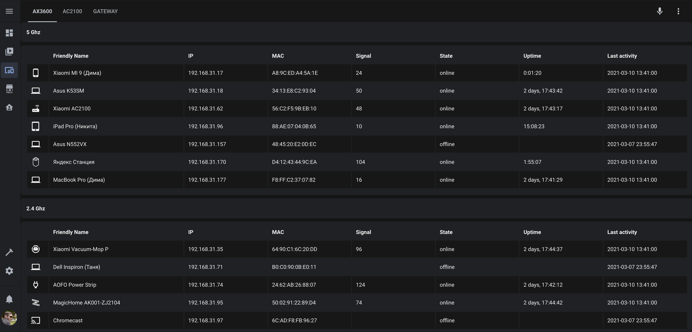

# MiWiFi for Home Assistant
[](https://github.com/custom-components/hacs)
[](https://paypal.me/dslonyara)
[](https://www.tinkoff.ru/sl/3FteV5DtBOV)

Component for tracking devices and managing routers based on [MiWiFi](http://miwifi.com/) from [Home Assistant](https://www.home-assistant.io/).

## Table of Contents
- [FAQ](#faq)
- [Install](#install)
- [Config](#config)
- [Advanced config](#advanced-config)
- [Services](#services)
- [Performance table](#performance-table)
- [Routers tested](#routers-tested)

## FAQ
**Q. Do I need to get telnet or ssh?**

A. Not. integration works through Luci-API

**Q. How often are states updated?**

A. Once every 10 seconds. This is the most optimal time for correct work.

**Q. In addition to tracking devices, what else does the integration allow you to do?**

A. The integration creates sensors to track the number of connected devices through different types of connections (`5 Ghz`, `2.4 Ghz`, `lan`). Creates binary sensors that track (`repeater mode`, `wifi state`, `wan state`). Creates switches to control `LEDs` and `reboot` the router. It also collects statistics on connected devices (Signal, Uptime, etc.)

**Q. Does the integration support legacy device tracking via `known_devices.yaml`?**

A. This is a legacy device tracking option. But the integration allows importing names, dev_id, icon from the file `known_devices.yaml` and associating with new devices by mac-address. To do this, simply create or rename the file to `legacy_known_devices.yaml`

**Q. Does the integration support routers connected in `repeater mode`?**

A. Yes, the integration supports devices connected in `repeater mode`. But to get the number of devices and their tracking, you will also need to connect and configure the parent router.

**Q. Can I use the router in repeater mode without a parent MiWiFi device?**

A. It is possible with the `force_load_repeater_devices` option enabled. But there is a limitation. You will not see IP, uptime, and connection type, but the name will be the mac-address.

## Install
Installed through the custom repository [HACS](https://hacs.xyz/) - `dmamontov/hass-miwifi`

Or by copying the `miwifi` folder from [the latest release](https://github.com/dmamontov/hass-miwifi/releases/latest) to the custom_components folder (create if necessary) of the configs directory.

## Config
**Via GUI (Recommended)**

`Settings` > `Integrations` > `Plus` > `MiWiFi`

For authorization, use the ip of your router and its password

**Via YAML (legacy way)**
```yaml
miwifi:
  ip_address: router_ip
  password: router_pass
  force_load_repeater_devices: False # PRO
```

## Advanced config
#### Automatically remove devices
The component supports automatic deletion of monitored devices after a specified number of days (Default: 30 days) after the last activity. If you specify 0, then automatic deletion will be disabled.

**Via GUI (Recommended)**

`Settings` > `Integrations` > `Your integration MiWiFi` > `Settings`

**Via YAML (legacy way)**
```yaml
miwifi:
  ...
  last_activity_days: 30 # PRO
```

## Services
#### Remove devices
The component contains a service that allows you to delete a device by device_id or entity_id

**Via GUI (Recommended)**

`Developer-tools` > `Service` > `miwifi.remove_devices`

**Via YAML (legacy way)**
```yaml
service: miwifi.remove_devices
target:
  device_id:
    - ...
  entity_id:
    - device_tracker....
```

## Performance table


1. Install [Auto-entities](https://github.com/thomasloven/lovelace-auto-entities) from HACS
2. Install [Flex Table](https://github.com/custom-cards/flex-table-card) from HACS
3. Add new Lovelace tab with **Panel Mode**
4. Add new Lovelace card: [example](https://gist.github.com/dmamontov/e6fa1842c486388387aaf061d3a82818)

## Routers tested
Many more Xiaomi and Redmi routers supported by MiWiFi (OpenWRT - Luci API)

| Router                                                                              | Firmware version           | Status                        |
| ----------------------------------------------------------------------------------- | -------------------------- | ----------------------------- |
| [Xiaomi AC2100](https://xiaomiplanets.com/review-xiaomi-ac2100-router/)             | 2.0.743(CN)                | Supported                     |
| [Xiaomi AX3600](https://xiaomiplanets.com/xiaomi-aiot-router-ax3600-performance/)   | 1.0.79(CN), 3.0.22(Global) | Supported                     |
| [Xiaomi AX1800](https://xiaomiplanets.com/xiaomi-my-router-ax1800-performance-11/)  | 3.0.34(Global)             | Supported                     |
| [Xiaomi PRO R3P](https://xiaomiplanets.com/xiaomi-mi-router-for-hd-action-1/)       | 2.16.29(CN)                | With restrictions<sup>*</sup> |

<sup>*</sup> Not all integration options may be supported.
